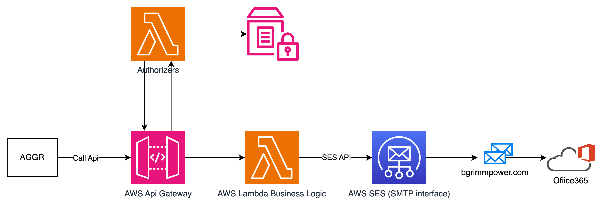

# AWS SES Email Sending API

This repository demonstrates a solution for sending emails securely via AWS SES using an API Gateway and AWS Lambda integration. The setup ensures security, scalability, and ease of use for clients needing to send emails from a verified domain.




---

## Features

- **Secure Integration**: Uses API Gateway and Lambda for secure email sending.
- **Authenticated Requests**: Requires clients to include an `Authorization` token for API access.
- **AWS SES Integration**: Sends emails via AWS SES using a verified sender domain.
- **Customizable**: Supports dynamic email content in the API requests.

---

## How It Works

1. **Client Request**: Clients send a POST request to the API Gateway endpoint with the required `Authorization` token.
2. **Authorization**: API Gateway uses an AWS Lambda authorizer to validate the client's token.
3. **Email Processing**: If authenticated, Lambda processes the request and sends the email through AWS SES.

---

## API Specifications

### Endpoint  
API Gateway provides a URL for making POST requests:  
`https://<your-api-id>.execute-api.ap-southeast-1.amazonaws.com/prod/emailNotification`

### Request Format

#### Headers
```http
Authorization: YOUR_AUTH_TOKEN
```

#### JSON Body
```json
{
    "from_address": "sender@example.com", 
    "from_name": "Sender Name",
    "to_address": "recipient@example.com",
    "email_subject": "Subject of the email"
}
```

### Example Request
```http
POST /send-email
Host: https://<your-api-id>.execute-api.ap-southeast-1.amazonaws.com/prod/emailNotification
Authorization: YOUR_AUTH_TOKEN

{
    "from_address": "sender@example.com",
    "from_name": "Sender Name",
    "to_address": "recipient@example.com",
    "email_subject": "Test Lambda Function"
}
```

---

## Prerequisites

- **AWS SES**: Your sender domain must be verified in SES.
- **AWS Lambda**: Contains the email-sending logic.
- **API Gateway**: Acts as the entry point for clients to send requests.

---
